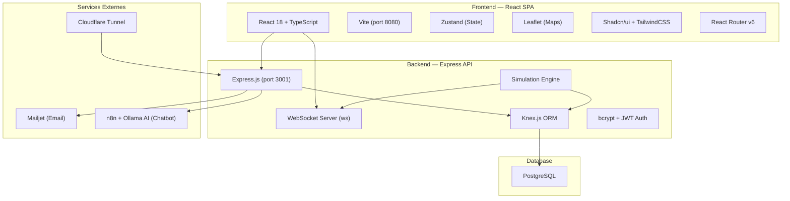
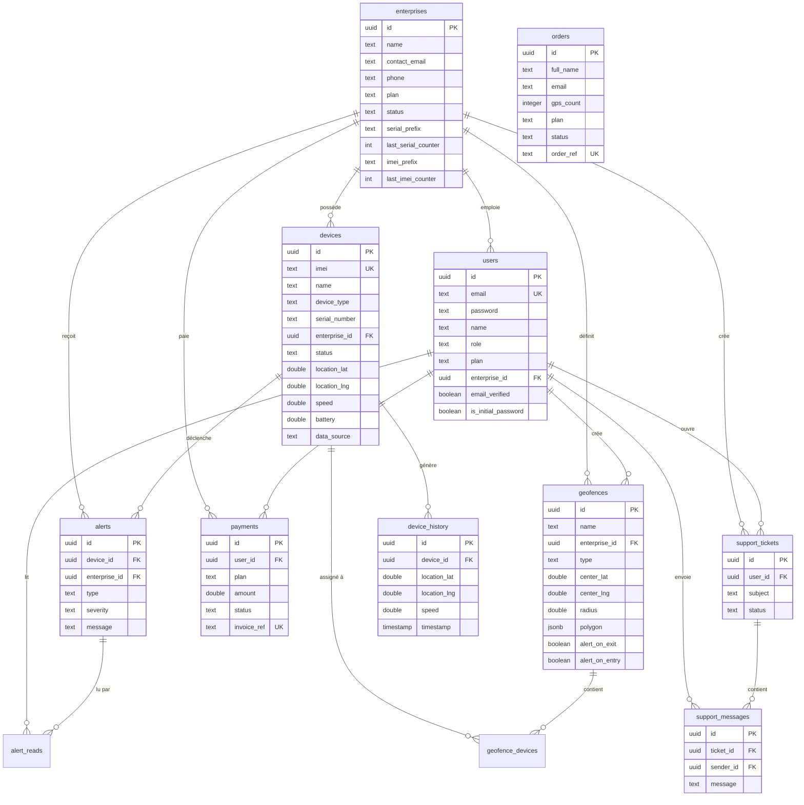
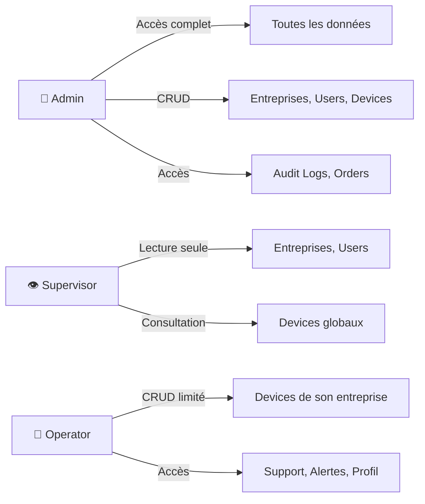
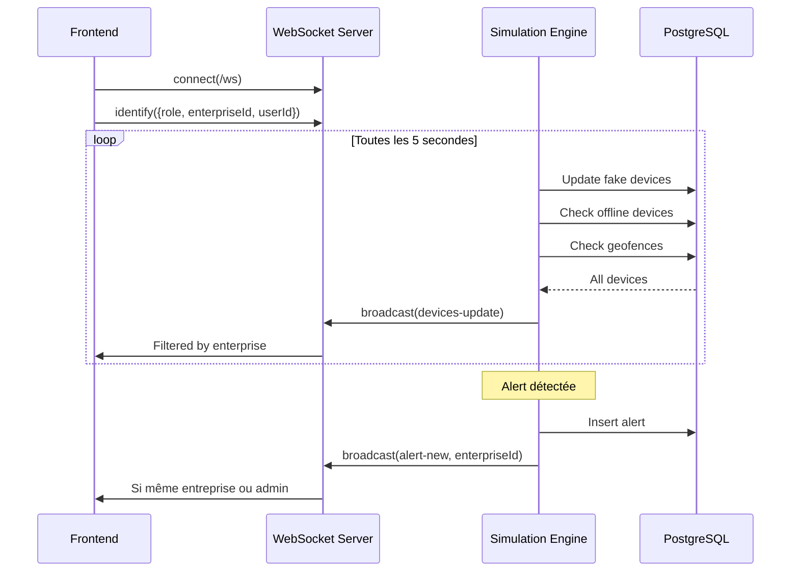

# 📊 Rapport Complet d'Analyse — GeoTrack Platform

> **Projet** : Enterprise Guard Track (GeoTrack)  
> **Type** : Plateforme SaaS de géolocalisation GPS multi-entreprises  
> **Date d'analyse** : 1 Avril 2026  
> **Marché cible** : Tunisie

---

## 1. Description Générale du Projet

GeoTrack est une **plateforme complète de suivi GPS en temps réel** destinée aux entreprises tunisiennes. Elle permet de géolocaliser véhicules, personnes, animaux et objets de valeur via des traceurs GPS professionnels, avec une interface web moderne et un tableau de bord complet.

**Proposition de valeur** :
- Vente et gestion de traceurs GPS (110 TND/unité)
- Plateforme de suivi en temps réel avec carte interactive
- Gestion multi-entreprises (multi-tenant)
- Système d'alertes automatiques (vitesse, batterie, géofences)
- Support technique intégré avec chat en temps réel

---

## 2. Architecture Technique

### 2.1 Vue d'ensemble



### 2.2 Stack Frontend

| Technologie | Version | Usage |
|---|---|---|
| React | 18.3.1 | Framework UI |
| TypeScript | 5.8.3 | Typage statique |
| Vite | 5.4.19 | Build tool + Dev server (port 8080) |
| Zustand | 5.0.9 | State management (2 stores: Auth + App) |
| React Router | 6.30.1 | Routage SPA |
| Leaflet + react-leaflet | 1.9.4 / 5.0.0 | Cartographie interactive |
| Shadcn/ui (Radix) | Multiple | 49 composants UI |
| TailwindCSS | 3.4.17 | Styling utilitaire |
| Recharts | 2.15.4 | Graphiques dashboard |
| Tanstack React Query | 5.83.0 | Cache & requêtes serveur |
| date-fns | 3.6.0 | Manipulation de dates |
| jsPDF + AutoTable | 4.2.1 | Export PDF |
| xlsx | 0.18.5 | Export Excel |
| Zod | 3.25.76 | Validation de schémas |
| Sonner | 1.7.4 | Notifications toast |

### 2.3 Stack Backend

| Technologie | Version | Usage |
|---|---|---|
| Express.js | 4.18.2 | Serveur HTTP REST API |
| ws | 8.14.2 | WebSocket temps réel |
| Knex.js | 3.2.7 | Query builder SQL (PostgreSQL) |
| pg | 8.20.0 | Driver PostgreSQL |
| bcryptjs | 3.0.3 | Hachage de mots de passe |
| jsonwebtoken | 9.0.3 | Tokens JWT |
| node-mailjet | 6.0.11 | Envoi d'emails transactionnels |
| Mongoose | 8.0.3 | Legacy (migration MongoDB) |
| uuid | 13.0.0 | Génération d'identifiants |

### 2.4 Infrastructure

| Service | Rôle |
|---|---|
| PostgreSQL | Base de données principale |
| Cloudflare Tunnel | Exposition publique du tracker (HTTPS) |
| n8n | Workflow automation pour chatbot AI |
| Ollama (gemma3:1b) | Modèle LLM local pour assistant commercial |

---

## 3. Structure du Projet

### 3.1 Arborescence principale

```
enterprise-guard-track/
├── src/                          # Frontend React
│   ├── App.tsx                   # Routage + providers
│   ├── main.tsx                  # Point d'entrée
│   ├── index.css                 # Styles globaux
│   ├── pages/                    # 19 pages
│   ├── components/               # Composants réutilisables
│   │   ├── ui/                   # 49 composants Shadcn/ui
│   │   ├── layout/               # DashboardLayout, Sidebar, PublicNavbar
│   │   ├── auth/                 # ProtectedRoute, RoleRoute, PlanRoute
│   │   ├── map/                  # MapView, HistoryMapView
│   │   ├── dashboard/            # AIChatWidget, StatsBar, EnterpriseDevicesSection
│   │   ├── devices/              # DeviceCard, DeviceList
│   │   ├── alerts/               # AlertsDropdown
│   │   ├── support/              # SupportChat
│   │   ├── modals/               # 7 modals (Device, Enterprise, User, etc.)
│   │   ├── ChatbotWidget.tsx     # Widget chatbot landing page
│   │   ├── JoinPopup.tsx         # Formulaire de commande
│   │   └── DemoPopup.tsx         # Modal démo
│   ├── hooks/                    # use-mobile, use-toast
│   └── lib/                      # Logique métier
│       ├── api.ts                # Client API REST (428 lignes)
│       ├── store.ts              # Zustand stores (856 lignes)
│       ├── types.ts              # Interfaces TypeScript
│       ├── permissions.ts        # RBAC helpers
│       ├── i18n.tsx              # Internationalisation FR/EN
│       ├── theme.tsx             # Theme provider (dark/light)
│       ├── utils-geo.ts          # Utilitaires géolocalisation
│       └── demoGuard.ts          # Protection mode démo
│
├── server/                       # Backend Express
│   ├── index.js                  # Point d'entrée serveur
│   ├── startup.js                # Démarrage tunnel + serveur
│   ├── tunnel.js                 # Cloudflare Tunnel
│   ├── routes/                   # 15 routeurs API
│   ├── models/                   # 12 modèles Mongoose (legacy)
│   ├── db/
│   │   ├── knex.js               # Connexion PostgreSQL
│   │   ├── migrate.js            # Création des tables
│   │   └── migrate-data.js       # Migration MongoDB → PostgreSQL
│   ├── simulation/
│   │   ├── engine.js             # Moteur de simulation GPS (536 lignes)
│   │   └── routes.js             # Itinéraires prédéfinis (Tunisie)
│   ├── utils/
│   │   ├── auditLogger.js        # Journal d'audit
│   │   └── mailjet.js            # Service email (Mailjet)
│   ├── services/email.js         # Service email legacy
│   ├── scripts/                  # Scripts utilitaires
│   └── n8n-*.json                # 3 workflows n8n
│
├── tracker-page/                 # Page web de tracking mobile
│   └── index.html                # Interface tracker GPS
│
└── Cahier des charges.pdf        # Document de spécifications
```

---

## 4. Schéma de Base de Données (PostgreSQL)

### 4.1 Diagramme des tables



### 4.2 Tables (12 au total)

| Table | Colonnes | Description |
|---|---|---|
| `enterprises` | 13 | Comptes entreprises clientes |
| `users` | 17 | Utilisateurs (admin/supervisor/operator) |
| `devices` | 26 | Appareils GPS avec position temps réel |
| `device_history` | 10 | Historique des positions |
| `alerts` | 7 | Alertes automatiques |
| `alert_reads` | 2 | Table de jonction lecture d'alertes |
| `geofences` | 12 | Zones géographiques |
| `geofence_devices` | 2 | Table de jonction zone-appareil |
| `orders` | 18 | Commandes clients |
| `payments` | 14 | Paiements et factures |
| `support_tickets` | 8 | Tickets de support |
| `support_messages` | 6 | Messages de chat support |
| `audit_logs` | 9 | Journal d'audit |
| `notification_rules` | 6 | Règles de notification email |

---

## 5. API REST — Routes Backend

### 5.1 Inventaire complet des endpoints (15 routeurs)

| Routeur | Préfixe | Méthodes | Description |
|---|---|---|---|
| `auth.js` | `/api/auth` | POST login, POST set-password | Authentification |
| `devices.js` | `/api/devices` | CRUD + GET history | Gestion appareils |
| `enterprises.js` | `/api/enterprises` | CRUD complet | Gestion entreprises |
| `users.js` | `/api/users` | CRUD + verification email | Gestion utilisateurs |
| `geofences.js` | `/api/geofences` | CRUD + POST check | Zones géographiques |
| `alerts.js` | `/api/alerts` | CRUD + PATCH read | Alertes système |
| `orders.js` | `/api/orders` | CRUD + process + track | Commandes |
| `billing.js` | `/api/billing` | Prices, plan, upgrade, cancel | Facturation |
| `support.js` | `/api/support` | Tickets + messages | Centre de support |
| `chat.js` | `/api/chat` | POST (chatbot public) | Chatbot landing |
| `dashboardChat.js` | `/api/dashboard-chat` | POST (AI dashboard) | Assistant IA |
| `stats.js` | `/api/stats` | GET dashboard stats | Statistiques |
| `track.js` | `/api/track` | POST position | Réception GPS tracker |
| `audit.js` | `/api/audit` | GET + POST | Journal d'audit |
| `notificationRules.js` | `/api/notification-rules` | CRUD | Règles de notification |

### 5.2 Endpoints spéciaux

| Endpoint | Description |
|---|---|
| `GET /api/health` | Vérification état serveur + DB |
| `GET /api/config` | Configuration dynamique (URLs) |
| `WS /ws` | WebSocket temps réel |
| `GET /tracker/` | Page tracker mobile (fichiers statiques) |

---

## 6. Système de Sécurité & RBAC

### 6.1 Rôles utilisateur



| Permission | Admin | Supervisor | Operator |
|---|---|---|---|
| Voir tous les appareils | ✅ | ✅ | ❌ (son entreprise) |
| Créer des appareils | ✅ | ❌ | ❌ |
| Modifier des appareils | ✅ | ❌ | ✅ (son entreprise) |
| Supprimer des appareils | ✅ | ❌ | ❌ |
| Gérer les entreprises | ✅ | ❌ (lecture) | ❌ |
| Gérer les utilisateurs | ✅ | ❌ (lecture) | ❌ |
| Audit logs | ✅ | ❌ | ❌ |
| Gestion commandes | ✅ | ❌ | ❌ |
| Support (chat) | ✅ (répondre) | ✅ (répondre) | ✅ (créer tickets) |
| Zones GPS (geofences) | ✅ | ✅ | ✅ (plan Pro+) |

### 6.2 Mécanismes de sécurité

- **Mot de passe** : Hachage bcrypt (10 rounds salt)
- **Vérification email** : Code OTP 6 chiffres via Mailjet (expiration 10 min)
- **Onboarding** : Changement de mot de passe initial obligatoire
- **Isolation des données** : Filtrage côté serveur par `enterprise_id`
- **Mode démo** : Compte `demo@geotrack.tn` en lecture seule (mutations bloquées)
- **Guards frontend** : `ProtectedRoute`, `RoleRoute`, `PlanRoute`

---

## 7. Fonctionnalités Implémentées

### 7.1 Pages Frontend (19 pages)

| # | Page | Fichier | Taille | Description |
|---|---|---|---|---|
| 1 | Landing Page | `Index.tsx` | 43 KB | Page publique vitrine avec sections |
| 2 | Login | `LoginPage.tsx` | 11 KB | Connexion + vérification email |
| 3 | Guide | `GuidePage.tsx` | 19 KB | Guide utilisateur en 5 étapes |
| 4 | Dashboard | `Dashboard.tsx` | 27 KB | Tableau de bord principal |
| 5 | Carte | `MapPage.tsx` | 6 KB | Carte temps réel Leaflet |
| 6 | Appareils | `DevicesPage.tsx` | 8 KB | Liste de tous les appareils |
| 7 | Détail Appareil | `DeviceDetailPage.tsx` | 51 KB | Détail complet + historique + carte |
| 8 | Entreprises | `EnterprisesPage.tsx` | 8 KB | Liste entreprises |
| 9 | Détail Entreprise | `EnterpriseDetailPage.tsx` | 16 KB | Info entreprise + ses appareils |
| 10 | Utilisateurs | `UsersPage.tsx` | 9 KB | Gestion des utilisateurs |
| 11 | Alertes | `AlertsPage.tsx` | 14 KB | Liste des alertes système |
| 12 | Zones GPS | `GeofencesPage.tsx` | 45 KB | Geofencing (cercle + polygone) |
| 13 | Support | `SupportCenter.tsx` | 16 KB | Chat support temps réel |
| 14 | Commandes | `OrdersPage.tsx` | 49 KB | Gestion des commandes |
| 15 | Facturation | `BillingPage.tsx` | 42 KB | Plans, paiements, factures |
| 16 | Paramètres | `SettingsPage.tsx` | 19 KB | Paramètres de l'application |
| 17 | Profil | `ProfilePage.tsx` | 10 KB | Profil utilisateur |
| 18 | Audit Logs | `AuditLogsPage.tsx` | 20 KB | Journal d'audit (admin) |
| 19 | 404 | `NotFound.tsx` | 1 KB | Page non trouvée |

### 7.2 Modules fonctionnels détaillés

#### 🗺️ Module Suivi GPS Temps Réel
- Carte interactive Leaflet avec markers dynamiques
- Mise à jour toutes les 5 secondes via WebSocket
- 11 types d'appareils supportés (vehicle, tracker, beacon, sensor, mobile, personal, asset, container, drone, camera, gps)
- 8 statuts d'appareils (online, offline, moving, idle, alert, stolen, lost, maintenance)
- Historique des trajets avec vue cartographique
- Calcul de distance parcourue (formule Haversine)

#### 🔔 Module Alertes Automatiques
- 5 types d'alertes : `battery`, `speed`, `geofence`, `sos`, `offline`
- 3 niveaux de sévérité : low, medium, high
- Cooldown anti-spam : 2 minutes entre alertes identiques
- Notifications toast en temps réel avec déduplication 10s
- Option son d'alerte configurable
- Règles de notification email par entreprise

#### 🗂️ Module Géofencing
- Zones circulaires et polygonales
- Alertes d'entrée et de sortie configurables
- Assignation d'appareils par zone
- Détection de transitions en temps réel (enter/exit)
- Vérification géofence intégrée au moteur de simulation
- Accès limité au plan Pro+

#### 📦 Module Commandes
- Formulaire de commande multi-étapes (popup + chatbot)
- Workflow de statut : pending → confirmed → installing → active
- Référence automatique (format GT-YYMM-XXXX)
- Emails transactionnels à chaque changement de statut
- Sources multiples : chatbot, popup, manuel
- Traitement automatique (création entreprise + user + devices)

#### 💳 Module Facturation
- 3 plans : Starter (49 TND), Pro (39 TND), Enterprise (sur mesure)
- 3 cycles de facturation : mensuel, semestriel (-10%), annuel (-20%)
- 3 méthodes de paiement : D17, Mastercard, Virement bancaire
- Référence facture automatique (INV-YYMM-XXXX)
- Historique des paiements avec export
- Annulation et reprise de plan

#### 🤖 Module Chatbot AI
- Chatbot commercial sur la landing page
- Assistant IA dans le dashboard (via n8n + Ollama)
- Modèle LLM local : gemma3:1b
- Mémoire de session avec fenêtre glissante (20 messages)
- Processus de commande guidé par l'IA

#### 💬 Module Support
- Système de tickets (open/closed)
- Chat temps réel via WebSocket
- Routing des messages : admin ↔ operator
- Notifications de nouveaux messages
- Interface split-panel (liste tickets + conversation)

#### 📊 Module Dashboard
- Statistiques en temps réel (total, online, moving, offline, alertes)
- Aperçu cartographique
- Liste des appareils en mouvement
- Alertes récentes
- Widget IA intégré

#### 🌐 Module i18n
- Support bilingue : Français (défaut) et Anglais
- 144 clés de traduction couvrant toutes les sections
- Persistance du choix de langue (localStorage)

#### 📝 Module Audit
- Journal complet des actions utilisateur
- Actions : login, logout, CRUD sur toutes les entités
- Filtrage par action et par utilisateur
- Export CSV

#### ⚙️ Module Simulation GPS
- Moteur de simulation réaliste (536 lignes)
- Itinéraires prédéfinis en Tunisie (Tunis, Ariana, Sousse, etc.)
- Profils comportementaux par type d'appareil (11 profils)
- Vitesses réalistes avec variations (virages = ralentissement)
- Génération automatique d'historique (chaque 3ème mise à jour)
- Détection automatique de dispositifs hors ligne (>10s)
- Pics de vitesse aléatoires (10% de chance)
- Drain de batterie réaliste

#### 📱 Module Tracker Mobile
- Page web statique servie par Express (`/tracker/`)
- Accessible via Cloudflare Tunnel (HTTPS public)
- Envoi de la position GPS du téléphone vers le serveur
- Token de tracking unique par appareil

---

## 8. Communication Temps Réel (WebSocket)

### 8.1 Architecture WebSocket



### 8.2 Types de messages

| Type | Direction | Description |
|---|---|---|
| `identify` | Client → Server | Identification du client (rôle, entreprise) |
| `devices-update` | Server → Client | Mise à jour positions (filtré par rôle) |
| `alert-new` | Server → Client | Nouvelle alerte |
| `support_message` | Server → Client | Nouveau message support |
| `support_ticket_update` | Server → Client | Mise à jour de ticket |

---

## 9. Intégrations Externes

| Service | Usage | Configuration |
|---|---|---|
| **Mailjet** | Emails transactionnels (vérification OTP, statut commande) | API Key + Secret dans code |
| **n8n** | Orchestration workflows chatbot | 3 workflows JSON (chat, order, dashboard-chat) |
| **Ollama** | LLM local (gemma3:1b) pour assistant commercial | Port 11434 |
| **Cloudflare Tunnel** | Exposition du tracker mobile en HTTPS | Via `cloudflared` CLI |

---

## 10. État des Composants UI (49 composants Shadcn/ui)

> [!TIP]
> Le projet utilise **49 composants Shadcn/ui** pré-configurés, couvrant la totalité des besoins d'interface : accordion, alert-dialog, avatar, badge, breadcrumb, button, calendar, card, carousel, chart, checkbox, collapsible, command, context-menu, dialog, drawer, dropdown-menu, form, hover-card, input, input-otp, label, menubar, navigation-menu, pagination, popover, progress, radio-group, resizable, scroll-area, select, separator, sheet, sidebar, skeleton, slider, sonner, switch, table, tabs, textarea, toast, toaster, toggle, toggle-group, tooltip.

---

## 11. Statistiques du Code

| Métrique | Valeur |
|---|---|
| **Pages frontend** | 19 |
| **Composants React** | ~70+ |
| **Routes API** | 15 routeurs, ~60+ endpoints |
| **Modèles de données** | 12 (Mongoose legacy) + 14 tables PostgreSQL |
| **Lignes de code (store.ts)** | 856 |
| **Lignes de code (api.ts)** | 428 |
| **Lignes de code (simulation engine)** | 536 |
| **Lignes de code (migration)** | 358 |
| **Clés de traduction i18n** | 144 |
| **Composants Shadcn/ui** | 49 |
| **Taille page DeviceDetail** | 51 KB (la plus grande) |
| **Taille page OrdersPage** | 49 KB |
| **Taille page GeofencesPage** | 45 KB |

---

## 12. Migration de Base de Données

> [!IMPORTANT]
> Le projet a été **migré de MongoDB vers PostgreSQL**. Les modèles Mongoose (`server/models/`) sont conservés comme legacy, mais toute la logique active utilise Knex.js avec PostgreSQL.

| Aspect | Avant | Après |
|---|---|---|
| Base de données | MongoDB (Mongoose) | PostgreSQL (Knex.js) |
| IDs | ObjectId MongoDB | UUID v4 PostgreSQL |
| Location | GeoJSON `{type, coordinates}` | Colonnes `location_lat`, `location_lng` |
| Relations | Embedded/Population | Clés étrangères + JOIN |
| Geofence devices | Array dans document | Table de jonction `geofence_devices` |
| Alert read status | Array `readBy` | Table de jonction `alert_reads` |

---

## 13. Points Forts du Projet

✅ **Architecture complète** — Frontend + Backend + DB + WebSocket + Email + AI  
✅ **Temps réel** — WebSocket avec filtrage par rôle/entreprise  
✅ **Multi-tenant** — Isolation stricte des données par entreprise  
✅ **RBAC robuste** — 3 rôles avec permissions granulaires  
✅ **Simulation réaliste** — Moteur GPS avec profils comportementaux  
✅ **Géofencing avancé** — Cercle + Polygone avec détection de transitions  
✅ **i18n** — Interface bilingue FR/EN  
✅ **Mode démo** — Accès lecture seule sans inscription  
✅ **Emails transactionnels** — Vérification + Notifications de commande  
✅ **IA intégrée** — Chatbot commercial + Assistant dashboard  
✅ **Export** — PDF (jsPDF) et Excel (xlsx) supportés  
✅ **Thème** — Mode clair/sombre via next-themes  

---

## 14. Points d'Amélioration Identifiés

> [!WARNING]
> Les points suivants méritent attention pour un déploiement production.

| # | Catégorie | Description |
|---|---|---|
| 1 | **Sécurité** | Clés API Mailjet en dur dans le code source (mailjet.js) |
| 2 | **Sécurité** | Pas de middleware d'authentification JWT sur les routes API |
| 3 | **Sécurité** | CORS configuré en `origin: '*'` (trop permissif) |
| 4 | **Performance** | Pas de pagination côté serveur sur certaines routes (audit, alerts) |
| 5 | **Architecture** | Modèles Mongoose encore présents (dead code) |
| 6 | **Tests** | Aucun test unitaire ou d'intégration |
| 7 | **DevOps** | Pas de Dockerfile ni CI/CD |
| 8 | **API** | Pas de versioning des endpoints (`/api/v1/...`) |
| 9 | **Monitoring** | Aucun logging structuré ni monitoring (APM) |
| 10 | **Documentation** | Pas de documentation API (Swagger/OpenAPI) |

---

## 15. Conclusion

GeoTrack est un projet **fonctionnel et abouti** qui couvre l'ensemble des besoins d'une plateforme SaaS de géolocalisation GPS. L'architecture full-stack avec React/Express/PostgreSQL/WebSocket offre une base solide, et le moteur de simulation GPS permet des démonstrations réalistes. Le système multi-tenant avec RBAC, le géofencing avancé, l'intégration IA, et les emails transactionnels en font une solution complète. Les axes d'amélioration principaux concernent la sécurité des API (JWT middleware, secrets management) et l'ajout de tests automatisés pour assurer la fiabilité en production.
